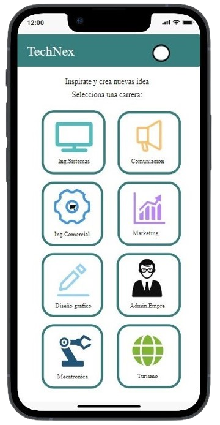
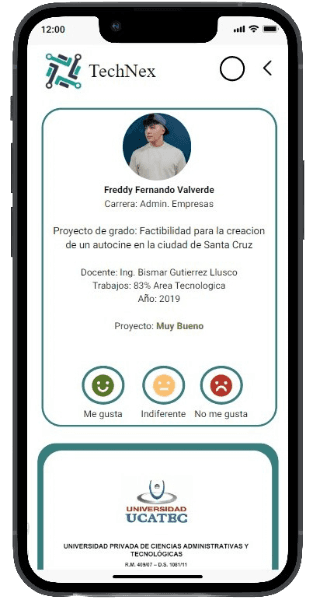

# SOFTWARE TECH-NEXT
<center> </center>

<!--  <p align="center"><a href="https://laravel.com" target="_blank"></a></p>-->
## Descripción
Este sistema adaptativo sera de gran ayuda para los estudiantes que se encuentran en los últimos semestres universitarios permitiendo facilitar ideas personalizadas para sus proyectos de grado. El sistema toma en cuenta sus intereses académicos, las tendencias del mercado y las necesidades sociales para ofrecer una variedad de opciones viables y relevantes. De esta manera, se facilita la selección del tema ideal para su proyecto final.

## Objetivo
Facilitar a los estudiantes de últimos semestres universitarios la selección de un tema viable y relevante para su proyecto final, mediante un sistema que permita ofrecer una variedad de ideas personalizadas.

## Caracteristicas principales

### Funcionalidad Usuario

* Seleccionar una carrera para realizar una búsqueda específica
* Búsqueda por titulo del proyecto
* Visualizar el contenido
* Reaccionar al contenido encontrado

### Funcionalidad Administrador
  
* Ingresar al sistema mediante un login y contraseña
  
## Diseño del Sistema
### Mockups: Dispositivo Movil

<p align="center"><a target="_blank"></a></p>

---
> El usuario al ingresar al sistema podrá seleccionar una carrera en específico, esto permitirá al sistema enfocar la búsqueda y ofrecer resultados más relevantes y precisos en cuanto al área de interés del usuario brindando una experiencia más personalizada y eficiente.
---
<p align="center"><a target="_blank"></a></p>

---
> A medida que el usuario realiza la búsqueda, el sistema mostrará la información del contenido utilizando un formato de lista de manera ordenada y concisa, facilitando la búsqueda y comparación de proyectos, permitiendo al usuario navegar de forma rápida y eficiente ajusatndose a sus necesidades.

---
<p align="center"> </p>

> El usuario podrá acceder a una descripción detallada del proyecto incluyendo el autor, carrera, año de realización, entre otros. No obstante, el usuario tendrá la posibilidad de interactuar con el contenido mediante tres reacciones específicas, lo cual ayudará a otros usuarios a tener una mejor idea del contenido.

---

## Modelo UML
* Diagrama de clases
* Diagrama de casos de uso
* Diagrama de secuencia
* Diagrama de actividad
* Diagrama de estado
* Diagrama de despliegue

## Tecnologías utilizadas
Se usaran las siguientes tecnologías para el desarrollo del software.

* Lenguajes de programación
  * JavaScript (Frontend)
  * TypeScript

* Frameworks
  * Laravel (Backend)
  * React (Frontend)

* Base de Datos
  * MySql
   
* Herramientas adicionales
  * Git
  * GitHub
  * Node.js (entorno de ejecución)
  * Mockitt (Herramienta de creación de prototipos)
  * phpMyAdmin (Gestor de base de datos)
  * Asana (Herramienta de gestión de proyectos)
  * Whatsapp (Herramienta de comunicación)

## Instalación
Se seguiran una serie de pasos para realizar la intalación de las tecnologias para la creación del proyecto.

1. Clonar el repositorio 

``` 
$ git clone https://github.com/NorvicSoftware/tech-next.git
```  
2. Ingresar al proyecto Tech-Next
```
```
3. Instalar dependencias
```
```
4. ...

## Personas Contribuyentes

## Licencia


<p align="center"><a href="https://laravel.com" target="_blank"></a></p>

<p align="center">
<a href="https://github.com/laravel/framework/actions"></a>
<a href="https://packagist.org/packages/laravel/framework"></a>
<a href="https://packagist.org/packages/laravel/framework"></a>
<a href="https://packagist.org/packages/laravel/framework"></a>
</p>

## About Laravel

Laravel is a web application framework with expressive, elegant syntax. We believe development must be an enjoyable and creative experience to be truly fulfilling. Laravel takes the pain out of development by easing common tasks used in many web projects, such as:
``
- [Simple, fast routing engine](https://laravel.com/docs/routing).
- [Powerful dependency injection container](https://laravel.com/docs/container).
- Multiple back-ends for [session](https://laravel.com/docs/session) and [cache](https://laravel.com/docs/cache) storage.
- Expressive, intuitive [database ORM](https://laravel.com/docs/eloquent).
- Database agnostic [schema migrations](https://laravel.com/docs/migrations).
- [Robust background job processing](https://laravel.com/docs/queues).
- [Real-time event broadcasting](https://laravel.com/docs/broadcasting).

Laravel is accessible, powerful, and provides tools required for large, robust applications.

## Learning Laravel

Laravel has the most extensive and thorough [documentation](https://laravel.com/docs) and video tutorial library of all modern web application frameworks, making it a breeze to get started with the framework.

You may also try the [Laravel Bootcamp](https://bootcamp.laravel.com), where you will be guided through building a modern Laravel application from scratch.

If you don't feel like reading, [Laracasts](https://laracasts.com) can help. Laracasts contains thousands of video tutorials on a range of topics including Laravel, modern PHP, unit testing, and JavaScript. Boost your skills by digging into our comprehensive video library.

## Laravel Sponsors

We would like to extend our thanks to the following sponsors for funding Laravel development. If you are interested in becoming a sponsor, please visit the [Laravel Partners program](https://partners.laravel.com).

### Premium Partners

- **[Vehikl](https://vehikl.com/)**
- **[Tighten Co.](https://tighten.co)**
- **[WebReinvent](https://webreinvent.com/)**
- **[Kirschbaum Development Group](https://kirschbaumdevelopment.com)**
- **[64 Robots](https://64robots.com)**
- **[Curotec](https://www.curotec.com/services/technologies/laravel/)**
- **[Cyber-Duck](https://cyber-duck.co.uk)**
- **[DevSquad](https://devsquad.com/hire-laravel-developers)**
- **[Jump24](https://jump24.co.uk)**
- **[Redberry](https://redberry.international/laravel/)**
- **[Active Logic](https://activelogic.com)**
- **[byte5](https://byte5.de)**
- **[OP.GG](https://op.gg)**

## Contributing

Thank you for considering contributing to the Laravel framework! The contribution guide can be found in the [Laravel documentation](https://laravel.com/docs/contributions).

## Code of Conduct

In order to ensure that the Laravel community is welcoming to all, please review and abide by the [Code of Conduct](https://laravel.com/docs/contributions#code-of-conduct).

## Security Vulnerabilities

If you discover a security vulnerability within Laravel, please send an e-mail to Taylor Otwell via [taylor@laravel.com](mailto:taylor@laravel.com). All security vulnerabilities will be promptly addressed.

## License

The Laravel framework is open-sourced software licensed under the [MIT license](https://opensource.org/licenses/MIT).
