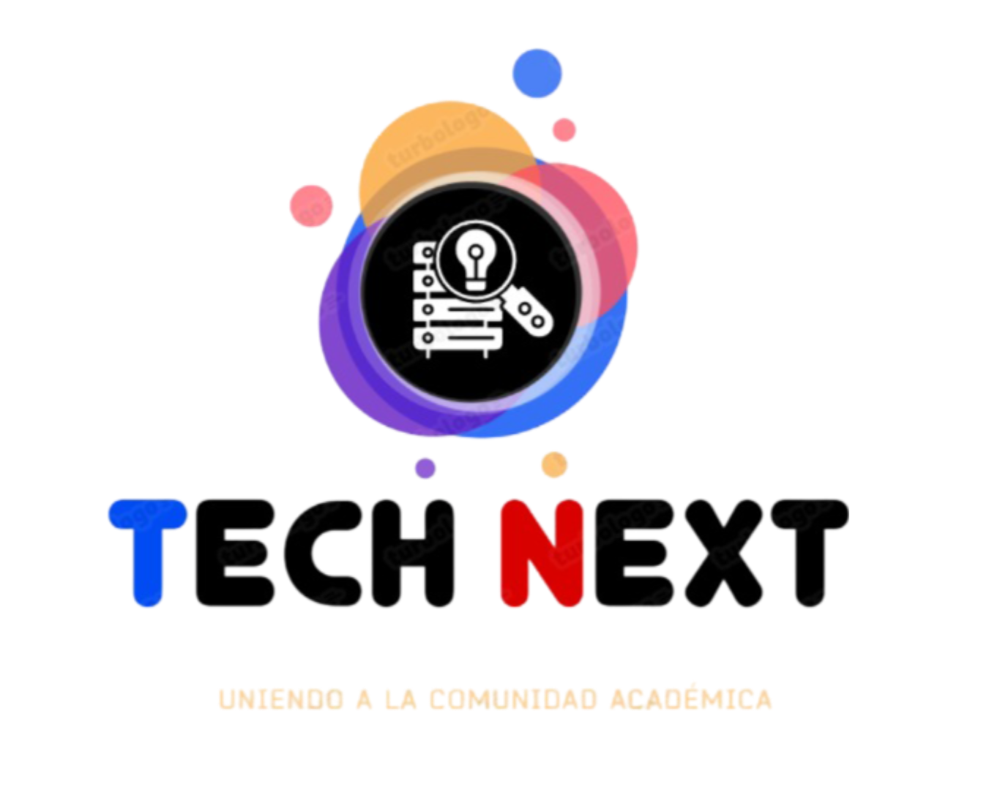
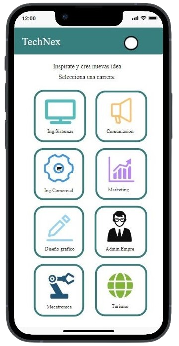
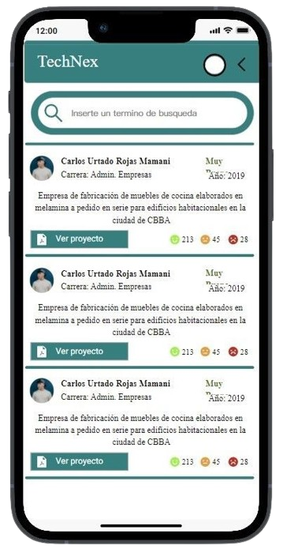
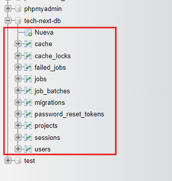
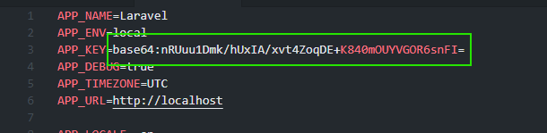
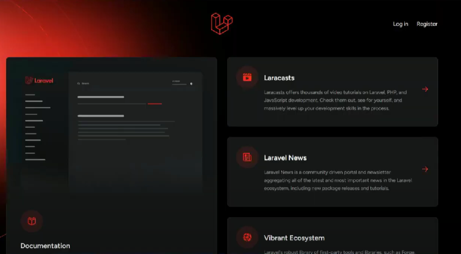

# SOFTWARE TECH-NEXT
<center> </center>

## Descripción
Este sistema adaptativo sera de gran ayuda para los estudiantes que se encuentran en los últimos semestres universitarios permitiendo facilitar ideas personalizadas para sus proyectos de grado. El sistema toma en cuenta sus intereses académicos, las tendencias del mercado y las necesidades sociales para ofrecer una variedad de opciones viables y relevantes. De esta manera, se facilita la selección del tema ideal para su proyecto final.

## Objetivo
Facilitar a los estudiantes de últimos semestres universitarios la selección de un tema viable y relevante para su proyecto final, mediante un sistema que permita ofrecer una variedad de ideas personalizadas.

## Caracteristicas principales

### Funcionalidad Usuario

* Realizar busqueda del proyecto de grado
* Selección de proyectos por medio de carreras.
* Selecionar y visualizar proyecto 
* Reaccionar al contenido encontrado
* Solicitar el proyecto.

### Funcionalidad Administrador
 
* Iniciar sesión
* Administrar los proyectos
* Ingresar al sistema
* Edición de datos
* Eliminación de datos
* Importar documentos
* Actualizar datos

## Diseño del Sistema
### Mockups: Dispositivo Movil

<p align="center"><a target="_blank"></a></p>

---
> El sistema presentará una serie de botones diferenciados por carreras universitarias.
> 
> El usuario al ingresar al sistema podrá seleccionar una carrera en específico, esto permitirá al sistema enfocar la búsqueda y ofrecer resultados más relevantes y precisos en cuanto al área de interés del usuario brindando una experiencia más personalizada y eficiente.
---
<p align="center"><a target="_blank"></a></p>

---
>El sistema tendrá una función de búsqueda que permitirá al usuario encontrar fácilmente los proyectos específicos que necesita. Además, ofrecerá un modo oscuro para una mejor experiencia visual, especialmente en condiciones de poca luz o para usuarios que prefieren una interfaz más tenue.
>
>A medida que el usuario realiza la búsqueda, el sistema mostrará la información del contenido utilizando un formato de lista de manera ordenada y concisa, facilitando la búsqueda y comparación de proyectos, permitiendo al usuario navegar de forma rápida y eficiente ajusatndose a sus necesidades.

---
<p align="center"> </p>

---
> El usuario podrá acceder a una descripción detallada del proyecto incluyendo el autor, carrera, año de realización, entre otros. No obstante, el usuario tendrá la posibilidad de interactuar con el contenido mediante tres reacciones específicas, lo cual ayudará a otros usuarios a tener una mejor idea del contenido.

---

## Modelo UML

Son una herramienta fundamental para el desarrollo de software, ya que permite visualizar y comprender de manera gráfica los diferentes aspectos del sistema, facilitando la comunicación entre los miembros del equipo de desarrollo y evitando errores en las primeras etapas del proyecto.

* Diagrama de Clases 
  * [Diagr. Administrador](https://i.ibb.co/PhWxx1J/Diagrama-Clases-Admin-Tech-Next.png "Link")
  * [Diagr. Usuario](https://i.ibb.co/d4PXkWQ/Diagrama-Clases-Usuar-Tech-Next.png "Link")
  
* Diagrama de Casos de Uso
  * [Diagr. Buscar proyecto](https://i.ibb.co/Gp1Trh7/Diag-Ca-U.png "Link")
  * [Diagr. Registrar proyecto](https://i.ibb.co/9syzqPt/Diagrama-Caso-Uso2-Tech-Next.png "Link")
 
* Diagrama de Secuencia
  * [Diagr. Administrador](https://i.ibb.co/c1TdLRg/Diagrama-Secuencia-Admin.png "Link")
  * [Diagr. Usuario](https://i.ibb.co/yqHfTtc/Diagrama-Secuencia-Usuario.png "Link")

* Diagrama de actividad
  * [Diagr. Administrador](https://i.ibb.co/khNJDXC/Diagrama-Actividad-Admin.pngg "Link")
  * [Diagr. Usuario](https://i.ibb.co/tDkWq6x/Diagrama-Actividad-Usuario.png "Link")
  
* Diagrama de estado
  * [Diagr. Administrador]("Link")
  * [Diagr. Usuario]("Link")
  
* Diagrama de despliegue
  * [Diagr. Administrador]( "Link")
  * [Diagr. Usuario]("Link")
  
## Tecnologías utilizadas
Se usaran las siguientes tecnologías para el desarrollo del software.

* Lenguajes de programación
  * JavaScript (Frontend)
  * TypeScript
  * PHP

* Frameworks
  * Laravel (Backend)
  * React (Frontend)

* Base de Datos
  * MySql
   
* Herramientas adicionales
  * Git
  * GitHub
  * Visual Code (IDE)
  * Node.js (Entorno de ejecución)
  * Mockitt (Herramienta de creación de prototipos)
  * Xampp (Paquete de software gratuito)
  * phpMyAdmin (Gestor de base de datos)
  * COMPOSER (gestor de dependencias)
  * Asana (Herramienta de gestión de proyectos)
  * Whatsapp (Herramienta de comunicación)

## Instalación
Se seguiran una serie de pasos para realizar la intalación de las tecnologias para la creación del proyecto.

**NOTA.-**

> Tomar en cuentas la instalación de las ultimas versiones de PHP, NODE.JS, COMPOSER, REACT 

### Servidor 1
 ---

1. Abrir la terminal Git Bash e ir a la ruta para abrir el proyecto
```
$ cd c:
```
```
$ cd xampp/htdocs/
```

1. Clonar el repositorio desde GitHub | `<Code>` :[https://github.com/NorvicSoftware/tech-next](https://github.com/NorvicSoftware/tech-next "GitHub/Code/HTTPS")

``` 
$ git clone https://github.com/NorvicSoftware/tech-next.git
```  

3. Ingresar al proyecto en Git 
```
$ cd tech-next/
```

4. Actualizar los paquetes o dependencias 
```
$ composer update
```
**NOTA.-**
> Verificar en el proyecto tech-next la carpeta | vendor

5. Para ingresar al proyecto *tech-next* desde Visaul Code introducir lo siguiente
```
$ code .
```

6. Crear un archivo con el nombre **.env** y copiar las siguientes variables 

   `<Link>` :[https://styde.net/variables-de-entorno-en-laravel/](https://styde.net/variables-de-entorno-en-laravel/ "Link")

7. Crear la Base de Datos en phpMyAdmin desde xampp con el nombre **tech-next-db** y modificar en Visual Code la carpeta **.env** y guardar los cambios
```
DB_CONNECTION=mysql
DB_HOST=127.0.0.1
DB_PORT=3306
DB_DATABASE=tech-next-db
DB_USERNAME=root
DB_PASSWORD=
```
8. En la terminal Git introducir lo siguiente:
```
$ php artisan migrate:fresh
```
**NOTA.-**
>Esta acción permite actualizar la base de datos phpMyAdmin en el localhost, favor de verficar. 

---

<p align="center"><a target="_blank"></a></p>

---
9. En la terminal Git introducir lo siguiente 
```
$ php artisan serve
```
Seguidamente ir a un navegador y copiar | `<Enlace>` :[http://127.0.0.1:8000/](http://127.0.0.1:8000/ "Servidor Laravel").

**IMPORTANTE.***

Te pedira | GENERAR CLAVE DE APLICACIÓN, desde la terminal para 1ro la terminal (Ctrl+C) e introduce lo siguiente:

```
 $ php artisan key:generate
```
Y verificar si apareció la siguiente clave en: Visaul Code/tech-next/.env

---
<p align="center"><a target="_blank"></a></p>

---
10. Por ultimo volver a levantar el servicio
```
$ php artisan serve
```
### Servidor 2

---
1. Abrir el proyecto tech-next desde la terminal Git
```
$ cd c:
```
```
$ cd xampp/htdocs/tech-next 
```
1. Seguidamente ir: `<Link>` :[https://laravel.com/](https://laravel.com/ "Laravel")
2. Ingresar a la opción | **DOCUMENTACIÓN** y después a la opción | **Starter Kits** que esta en la parte izquierda introducir el siguiente:
```
$ composer require laravel/breeze --dev
```
Esta acción permite instalar el paquete **Laravel Brezee**
3. Después ejecutar el siguiente comando.
```
$ php artisan breeze:install
```
4. Seguidamente escribir escoger la opción | `<React with Inertia ................................. react>`

```
 ❯ react
```
5. Escoger la opción |`<Dark>`
```
 ❯ Dark
```
6. Seguidamente la opción |`<1>`
```
 ❯ 1
```
7. Ya estando en los últimos pasos ejecutar el siguiente comando
```
$ npm install
```

8. Y por último levantar el servicor de React
```
$ npm run dev
```
Verficar si muestra la siguiente imagen

---
<p align="center"><a target="_blank"></a></p>

---

## Colaboradores del proyecto

### Analistas
* Sharol Rojas 
* Esteysi Guzman
* Alcira Luque
* Sara Herbas 
* Jahaziel Arce 
### Desarrolladores 
* Cristian Barrios 
* Americo Alvarez 
* Maide Mamani 
* Marisol Herrera 
* Bernardo Gutierrez
* Alexander Flores 
* Adrian Gomez 
* Jhojan Coro
* Angel Tibubay
* Brian Cazorla
### Pruebas QUA
* Manuel Arevalo 
* Alan Colque 
* Kevin Vicente 
* Kevin Castellon
* Deanira Chambi 


